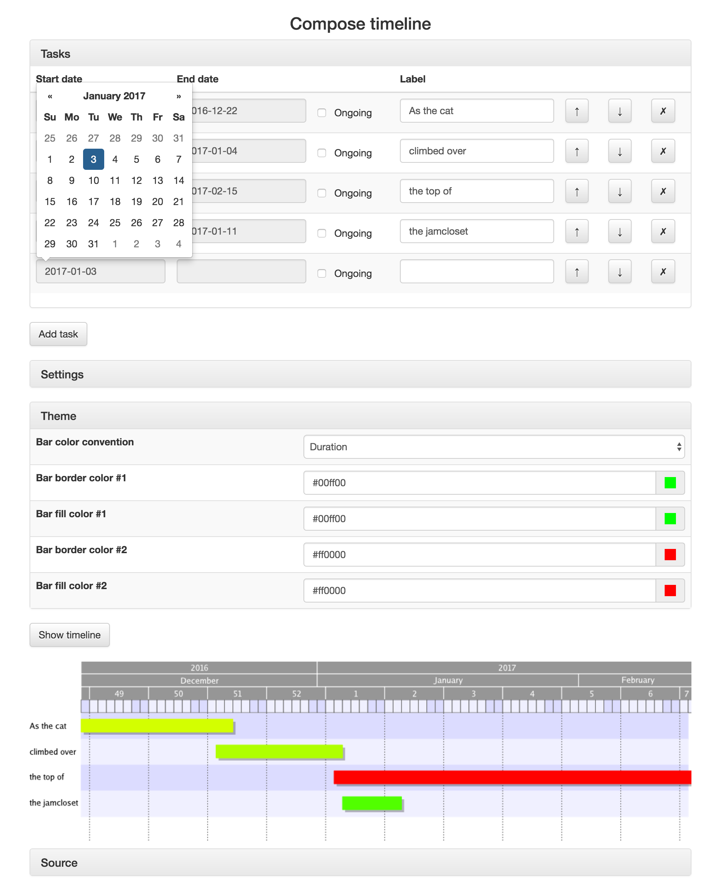

Timeline
========


**Fig. 1** Sample timeline

This is a tool for all makers of timelines fed up with dragging boxes, arrows and dotted lines around.

It supports three main use cases:

* Server
* Command line tool
* GUI (experimental)



**Fig. 2** Experimental GUI

The timeline is generated from a simple JSON file, which can be composed in the GUI, sent via POST request or specified on the command line.

For example, the timeline in **Fig. 1** above was generated from the following input:
```json
{
  "settings": {
    "zoom": 200,
    "hideDaysFrom": 180,
    "hideWeeksFrom": 365
  },
  "theme": {
    "colorScheme": "gradient",
    "borderColor1": "#aaffaa",
    "fillColor1": "#bbffbb",
    "borderColor2": "#ccffcc",
    "fillColor2": "#ddffdd",
    "frameBorderColor": "#ffffff",
    "frameFillColor": "#aaaaaa",
    "stripeColorDark": "#dddddd",
    "stripeColorLight": "#eeeeee",
    "gridColor": "#888888"
  },
  "tasks": [
    {
      "start": "2016-01-01",
      "end": "2016-01-10",
      "label": "Do I",
      "endTo": [2]
    },
    {
      "start": "2016-02-12",
      "end": "2016-02-13",
      "label": "Dare",
      "recur": "14"
    },
    {
      "start": "2016-02-25",
      "end": "2016-04-10",
      "label": "Disturb",
      "milestones": ["2016-02-25"],
      "startTo": [1]
    },
    {
      "start": "2016-04-01",
      "end": "2016-05-03",
      "label": "The universe?",
      "milestones": ["2016-05-01"],
      "dateStamps": ["2016-04-01", "2016-05-01"]
    }
  ]
}
```

Where do I start?
-----------------

**Fig. 3** Another sample timeline (colors indicate task duration)

The best place to start is to create a timeline of your own. All JSON input is validated against the JSON Schema in folder [api](api) that defines the API.

The top-level property `tasks` lists all tasks to be visualized. Each task has to have a `start` and `end`. The `label` is optional and shown to the left if present. Each date string is formatted `yyyy-mm-dd`.

Milestones and date stamps can be specified as an array formatted the same way. Milestones are shown as diamond shapes; date stamps are vertical lines with day and month printed below. For milestones with date stamps the two can be combined.

The `startTo` and `endTo` properties describe arrow dependencies. Take the following example:
```
"endTo": [1, 2]
```
This configuration draws two arrows starting at the end of the current task, one pointing to the next task and another to the task after that.

The `recur` property sets up a recurring task: a fortnightly visit to a haunted house, for example, can be shown by setting `recur` to the string "14".


**Fig. 4** Unthemed timeline

The other two top-level properties of the JSON (`settings` and `theme`) are optional.

The first, `settings`, stores housekeeping info. `zoom` could be set to 100% or 200%, for example; the end date can be set to a date other than the last day of the last task; days and weeks can be hidden to prevent visual noise (by default, they are hidden when the duration of the timeline exceeds 90 and 180 days, respectively).

The `theme` property currently adopts one of two color schemes: 'gradient' (the option used in Fig. 1) paints tasks starting with one color and gradually reaching a second; 'duration' (see Fig. 3) uses the first color for the shortest duration and the second for the longest. The field `layoutSteps` specifies two durations measured in days: first, the timeline duration from which weekdays should be hidden and then the duration from which weeks should be hidden as well.

Placeholders
------------
Many timelines end with the present day. The shorthand for such a timeline is to set the top-level property `end` under `settings` to the placeholder "-". You can also use the `end` property to add padding at the end of a timeline, by specifying a date in the usual `yyyy-mm-dd` format.

You may also encounter tasks that are still ongoing: perhaps you are maintaining a list of ghostly apparitions that have been recorded but not yet explained. It would be annoying to have to move the end date of each such task along with each day that passes (there is after all the possibility that the apparition is inexplicable). To signify 'to the end of the timeline', set the task's `end` property to the placeholder '-'.

Here is a minimal example:
```json
{
  "settings": {
    "end": "-",
    "zoom": 150,
    "hideDaysFrom": 90,
    "hideWeeksFrom": 180
  },
  "tasks": [
    {
      "start": "2016-01-01",
      "end": "2016-01-25",
      "label": "The houses are haunted",
      "endTo": [1]
    },
    {
      "start": "2016-02-01",
      "end": "-",
      "label": "By white night-gowns"
    }
  ]
}
```

In this sample, the initial placeholder "-" signifies 'timeline ends today', whereas the "-" given in the second task signifies 'ongoing':


**Fig. 5** Minimal timeline with placeholders

Running `timeline`
------------------

If there is a \*.zip for your operating system under `timeline/dist`, you can download the zip and enter:
```
$ ./timeline path/to/some/datafile.json
```
In this case, `timeline` will parse `path/to/some/datafile.json` and generate a PNG image `path/to/some/datafile.png` from it. You can also drag and drop one or more JSON timeline definitions on the application binary if you prefer.

Calling `timeline` without parameters will launch the server:

```
$ ./timeline
Listening on port 8000
POST JSON sources to http://localhost:8000/timeline
Compose timelines at http://localhost:8000/timeline/compose
```

If you would rather not open port 8000, you can specify a different one using the `-p` switch:

```
$ ./timeline -p 8421
Listening on port 8421
POST JSON sources to http://localhost:8421/timeline
Compose timelines at http://localhost:8421/timeline/compose
```

Build
-----
Install Go using one of the installers available from `https://golang.org/dl/` and set up your `$GOPATH` as you see fit (`~/golang` will do).

Now it's time to clone `github.com/gerald1248/timeline`. The folder structure below `$GOPATH` should look as follows:
```
src
└── github.com
    └── gerald1248
        └── timeline
            ├── README.md
            ├── calendar.go
            ├── calendar_test.go
            ├── contributors.txt
            ├── data
            │   ├── sample.json
            │   ├── sample.png
            │   ├── sample_duration.json
            │   └── sample_duration.png
            ├── data.go
            ├── data_test.go
            ├── dist
            │   └── timeline-0.1.0-darwin.zip
            ├── draw.go
            ├── gulpfile.js
            ├── package.json
            ├── theme.go
            ├── theme_test.go
            └── timeline.go
```

Next, install Node.js with npm using your package manager. `cd` into the working directory `timeline` and enter:

```
$ npm install gulp
$ npm install go-bindata
$ npm install
```

Before running `gulp` (which builds and tests the program), fetch and install the dependencies:

```
$ go get -u github.com/jteeuwen/go-bindata/...
$ go get -u
```

With that, the workspace is ready. The default task (triggered by `gulp`) compiles `timeline` from source, runs the tests (very sketchy for now, sorry!), checks the source format, generates sample timelines and writes out a distributable zip for your operating system. (Only tested on MacOS, Windows and Ubuntu Linux 16.04 as it's early days.)

You can also run `gulp build`, `gulp test`, `gulp watch`, etc. individually if you wish.

